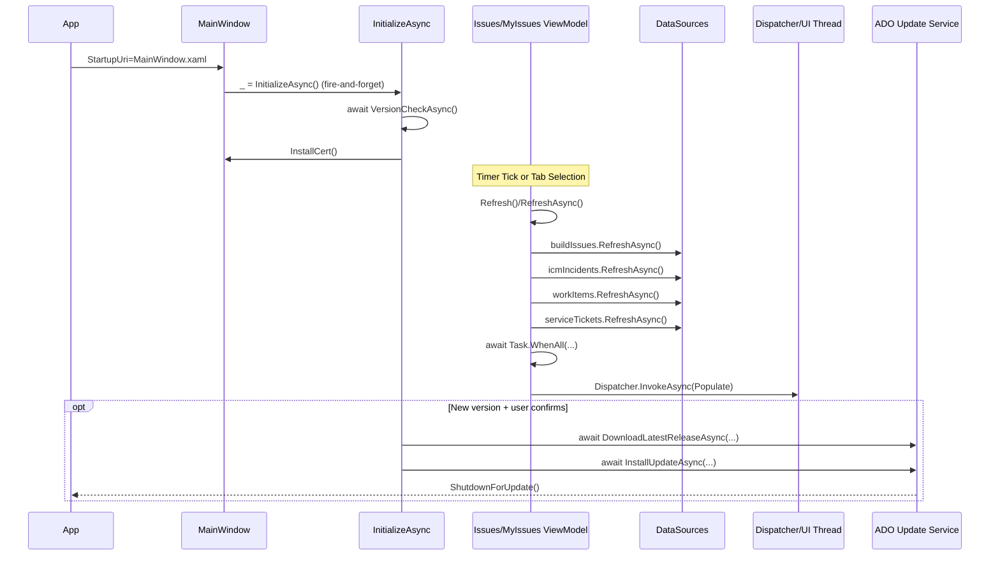
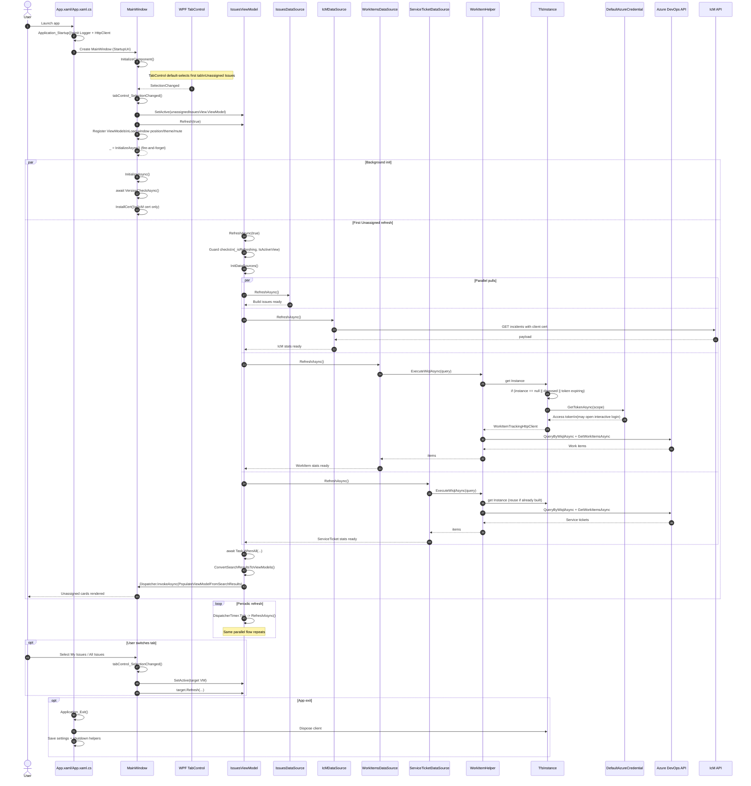

# OSP 项目解析

## 项目定位

OSP 是一个基于 WPF 的 .NET 8 Windows 桌面应用，用来集中展示和刷新多类问题数据。它更像一个内部问题看板，负责从多个外部系统拉取数据，聚合后按不同视角展示。

从项目文件可以看出：

- 应用类型：WPF 桌面程序
- 目标框架：`net8.0-windows`
- 主要依赖：Azure、Azure DevOps/TFS、IcM、SQL Client、Serilog、HttpClient

关键文件：

- `OSP/OSP.csproj`
- `OSP/App.xaml`
- `OSP/MainWindow.xaml`

## 启动流程

应用入口在 `OSP/App.xaml` 和 `OSP/App.xaml.cs`。

启动时主要做两件事：

1. 初始化日志基础设施
2. 初始化 HttpClient 基础设施

退出时主要做这些收尾工作：

1. 释放 TFS 相关实例
2. 保存用户设置
3. 关闭 HttpClient
4. 关闭日志系统

主窗口定义在 `OSP/MainWindow.xaml`，启动页就是 `MainWindow.xaml`。

## 主界面结构

主窗口包含三个标签页：

1. Unassigned Issues
2. My Issues
3. All Issues

另外还包含这些全局功能：

- 静音切换
- Light/Dark 主题切换
- 版本检查与自动更新
- 弹窗通知
- 窗口大小和位置记忆

主窗口后台代码在 `OSP/MainWindow.xaml.cs`，负责：

- 注册各个页面的 ViewModel
- 根据标签页切换当前激活的 ViewModel
- 触发刷新
- 处理主题、静音、更新等全局行为

## 项目分层

这个项目可以按职责分成几层：

### 1. Views

页面级视图，负责整体布局和绑定。

例如：

- `OSP/Views/IssuesView.xaml`
- `OSP/Views/MyIsssueView.xaml`
- `OSP/Views/AllIssuesView.xaml`

### 2. Controls

可复用 UI 组件，负责显示更细粒度的业务块。

例如：

- `OSP/Controls/BuildIssueStatisticsControl.xaml`

这个控件会显示：

- Lab 名称
- Build 号
- 持续时间
- Session 级别的问题统计块

### 3. ViewModels

负责给界面提供绑定数据，并驱动页面刷新。

关键文件：

- `OSP/ViewModels/IssuesViewModel.cs`
- `OSP/ViewModels/MyIssuesViewModel.cs`
- `OSP/ViewModels/IssueStatisticsViewModel.cs`
- `OSP/ViewModels/IssuesSessionStatisticsViewModel.cs`
- `OSP/ViewModels/ViewModelController.cs`

### 4. DataSources

负责从外部系统拉取原始数据。

例如：

- `OSP/DataSources/IssuesDataSource.cs`
- `OSP/DataSources/IcMDataSource.cs`
- `OSP/DataSources/WorkItemsDataSource.cs`
- `OSP/DataSources/ServiceTicketDataSource.cs`
- `OSP/DataSources/MyIssuesDataSource.cs`

### 5. Entities

负责承载原始数据和中间数据模型。

例如：

- `OSP/Entities/OpenIssueStatistics.cs`
- `OSP/Entities/SessionOpenIssueStatistics.cs`
- `OSP/Entities/BuildIssueRaw.cs`

### 6. Converters

负责把绑定值转换成 UI 需要的形式，例如颜色、显示数字、可见性等。

例如：

- `OSP/Converters/IssueCountToColorConverter.cs`
- `OSP/Converters/IssueCountToDisplayTextConverter.cs`

## 核心数据流

OSP 的主流程可以概括成：

1. 应用启动
2. 主窗口创建各个 View 和 ViewModel
3. 当前激活的 ViewModel 定时刷新
4. ViewModel 并行调用多个 DataSource 拉取数据
5. DataSource 把原始数据转换成实体模型
6. 实体模型再转换成 ViewModel
7. XAML 绑定这些 ViewModel 到列表和卡片控件
8. Converter 把统计值转换成颜色和展示文本

这是一种典型的“聚合多个数据源后统一展示”的桌面看板结构。

## IssuesViewModel 的职责

`OSP/ViewModels/IssuesViewModel.cs` 是核心控制层之一，主要职责包括：

- 读取刷新间隔配置
- 创建 DispatcherTimer
- 初始化多个数据源
- 并行刷新多个数据源
- 汇总结果并转换为 `IssueStatisticsViewModel`
- 更新绑定集合 `Statistics`
- 汇总错误信息并在有异常或需要提醒时播放声音

这个 ViewModel 支持三种视图类型：

- `All`
- `Active`
- `DDBuild`

也就是说，同一批基础数据会根据筛选规则展示成不同页面结果。

## IssuesDataSource 的职责

`OSP/DataSources/IssuesDataSource.cs` 负责构建 Build Issues 数据。

主要工作：

1. 从配置读取基础 URL 和需要提醒的 owner
2. 通过 RSS 地址拉取 issue 数据
3. 解析 XML 内容
4. 转换成 `OpenIssueStatistics`
5. 按 Lab、Build、Session 等维度聚合
6. 计算归属和分配状态

这里的业务规则直接决定：

- 哪些问题属于 DDBuild
- 哪些问题算未确认
- 每张统计卡片里要显示哪些 session

## 卡片与 Converter

`OSP/Controls/BuildIssueStatisticsControl.xaml` 是问题统计卡片的 UI 核心。

它内部会绑定 `SessionOpenIssueStatistics`，并使用两个关键 Converter：

- `IssueCountToColorConverter`
- `IssueCountToDisplayTextConverter`

它们的作用分别是：

- 根据问题类型数量决定 session 小块的背景色
- 根据问题数量决定 session 小块上显示哪个数字

例如颜色优先级是按顺序判断的：

1. LabIssueCount
2. StallIssueCount
3. OtherIssueCount
4. VSBFDIssueCount

谁先命中，就使用谁对应的颜色。

## 架构特点

这个项目的实现风格可以概括为：

- 使用 WPF 做界面
- 使用 ViewModel 承接绑定数据
- 使用 DataSource 抓取和整理外部数据
- 使用 Converter 处理展示细节
- 使用 code-behind 处理一部分窗口和交互逻辑

它不是严格意义上的纯 MVVM，更像是实用主义的混合结构。对内部业务工具来说，这种写法比较直接，维护成本也相对可控。

## 建议阅读顺序

如果要进一步理解 OSP，建议按下面顺序读：

1. `OSP/MainWindow.xaml` 和 `OSP/MainWindow.xaml.cs`
2. `OSP/Views/IssuesView.xaml`
3. `OSP/ViewModels/IssuesViewModel.cs`
4. `OSP/DataSources/IssuesDataSource.cs`
5. `OSP/Controls/BuildIssueStatisticsControl.xaml`
6. `OSP/Converters/IssueCountToColorConverter.cs`
7. `OSP/Converters/IssueCountToDisplayTextConverter.cs`

这样可以从入口、页面、控制层、数据层一路看到具体的 UI 呈现。

## Async 执行顺序

下面把项目里常见的 async 调用拆成三条链路：

1. 启动链路（主窗口初始化）
2. 刷新链路（定时器和标签页触发）
3. 更新链路（发现新版本后下载和安装）

### 1) 启动链路

- `App` 触发 `Application_Startup`
- 打开 `MainWindow`
- `MainWindow` 构造函数里 fire-and-forget 调用 `InitializeAsync`
- `InitializeAsync` 内部顺序执行：
	1. `await VersionCheckAsync()`
	2. `InstallCert()`

说明：`InitializeAsync` 自身是串行，但它是 fire-and-forget，不会阻塞窗口构造完成。

### 2) 刷新链路

- `DispatcherTimer.Tick` 触发 `RefreshAsync`
- 或者标签页切换时调用 `Refresh()`，再 fire-and-forget 到 `RefreshAsync`
- `RefreshAsync` 内部先并行跑多个数据源：
	- `buildIssues.RefreshAsync()`
	- `icmIncidents.RefreshAsync()`
	- `workItems.RefreshAsync()`
	- `serviceTickets.RefreshAsync()`
- 通过 `await Task.WhenAll(tasks)` 等待全部完成
- 全部完成后切回 UI 线程更新绑定集合（`Dispatcher.InvokeAsync`）

说明：单次刷新是“并行取数 + 串行汇总/UI 更新”。

### 3) 更新链路

在 `VersionCheckAsync` 里：

- 先 `await CheckAsync()`
- 若有新版本，再 `await GetLatestVersionStringAsync()`
- 用户确认后 `await PerformAutoUpdateAsync()`

在 `PerformAutoUpdateAsync` 里顺序执行：

1. `await DownloadLatestReleaseAsync(...)`
2. `await InstallUpdateAsync(...)`
3. 成功后执行关闭并重启更新流程

说明：更新流程整体是严格串行，前一步成功才进入下一步。

### 时序图（简化）

## 一句话结论

- 启动链路：`InitializeAsync` 内部串行，但调用方式是 fire-and-forget。
- 刷新链路：数据源并行，汇总和 UI 更新串行。
- 更新链路：下载和安装严格串行。

## Async 方法与行号索引

下面是与执行顺序最相关的方法/调用点索引，便于直接跳转代码。

| 文件 | 行号 | 方法/调用点 | 说明 |
|---|---:|---|---|
| `OSP/OSP/App.xaml` | 5 | `StartupUri="MainWindow.xaml"` | 主窗口启动入口 |
| `OSP/OSP/App.xaml` | 8 | `Startup="Application_Startup"` | 应用启动事件 |
| `OSP/OSP/App.xaml` | 7 | `Exit="Application_Exit"` | 应用退出事件 |
| `OSP/OSP/App.xaml.cs` | 12 | `Application_Startup(...)` | 初始化日志与 HttpClient |
| `OSP/OSP/App.xaml.cs` | 21 | `Application_Exit(...)` | 保存设置与资源释放 |
| `OSP/OSP/MainWindow.xaml.cs` | 38 | `_ = InitializeAsync();` | fire-and-forget 启动异步初始化 |
| `OSP/OSP/MainWindow.xaml.cs` | 42 | `InitializeAsync()` | 启动链路入口 |
| `OSP/OSP/MainWindow.xaml.cs` | 44 | `await VersionCheckAsync()` | 启动链路中的第一段 await |
| `OSP/OSP/MainWindow.xaml.cs` | 58 | `VersionCheckAsync()` | 版本检查 |
| `OSP/OSP/MainWindow.xaml.cs` | 84 | `await PerformAutoUpdateAsync()` | 用户确认更新后进入更新流程 |
| `OSP/OSP/MainWindow.xaml.cs` | 105 | `PerformAutoUpdateAsync()` | 下载/安装更新链路 |
| `OSP/OSP/MainWindow.xaml.cs` | 285 | `tabControl_SelectionChanged(...)` | 标签页切换触发刷新 |
| `OSP/OSP/MainWindow.xaml.cs` | 289/294/300 | `_viewModelController.SetActive(...)` | 切换当前激活 ViewModel |
| `OSP/OSP/MainWindow.xaml.cs` | 290/296/305/310 | `ViewModel.Refresh(...)` | 触发页面数据刷新 |
| `OSP/OSP/ViewModels/IssuesViewModel.cs` | 52 | `timer.Tick += ... RefreshAsync()` | 定时刷新触发点 |
| `OSP/OSP/ViewModels/IssuesViewModel.cs` | 63 | `Refresh(...)` | 外部触发入口（非阻塞） |
| `OSP/OSP/ViewModels/IssuesViewModel.cs` | 66 | `_ = RefreshAsync(firstTime)` | fire-and-forget 刷新 |
| `OSP/OSP/ViewModels/IssuesViewModel.cs` | 70 | `RefreshAsync(...)` | 刷新主流程 |
| `OSP/OSP/ViewModels/IssuesViewModel.cs` | 77 | `if (!IsActiveView)` | 非激活页直接返回 |
| `OSP/OSP/ViewModels/IssuesViewModel.cs` | 89-92 | `*.RefreshAsync()` | 多数据源并行任务创建 |
| `OSP/OSP/ViewModels/IssuesViewModel.cs` | 95 | `await Task.WhenAll(tasks)` | 等待并行任务全部完成 |
| `OSP/OSP/ViewModels/IssuesViewModel.cs` | 100 | `Dispatcher.InvokeAsync(...)` | 回到 UI 线程更新绑定 |
| `OSP/OSP/ViewModels/MyIssuesViewModel.cs` | 51 | `timer.Tick += ... RefreshAsync()` | 定时刷新触发点 |
| `OSP/OSP/ViewModels/MyIssuesViewModel.cs` | 71 | `Refresh(...)` | 外部触发入口（非阻塞） |
| `OSP/OSP/ViewModels/MyIssuesViewModel.cs` | 74 | `_ = RefreshAsync(firstTime)` | fire-and-forget 刷新 |
| `OSP/OSP/ViewModels/MyIssuesViewModel.cs` | 78 | `RefreshAsync(...)` | 刷新主流程 |
| `OSP/OSP/ViewModels/MyIssuesViewModel.cs` | 85 | `if (!IsActiveView)` | 非激活页直接返回 |
| `OSP/OSP/ViewModels/MyIssuesViewModel.cs` | 97-99 | `*.RefreshAsync()` | 多数据源并行任务创建 |
| `OSP/OSP/ViewModels/MyIssuesViewModel.cs` | 102 | `await Task.WhenAll(tasks)` | 等待并行任务全部完成 |
| `OSP/OSP/ViewModels/MyIssuesViewModel.cs` | 112 | `Dispatcher.InvokeAsync(...)` | 回到 UI 线程更新绑定 |

## 时序图（详细版）

下面这张图覆盖了从启动到首次触发登录的完整链路，包含并行刷新分支。

