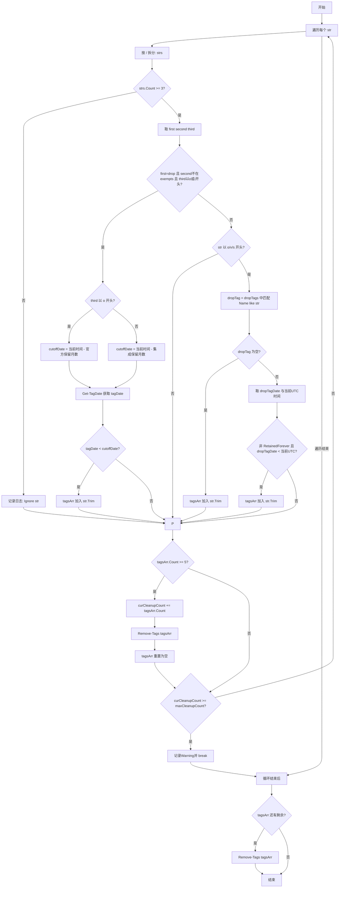

# Tag 清理流程

> [!TIP]
> 每批最多清理 5 个；达到 maxCleanupCount 后立即停止。

## 流程图

## 规则速览
| 场景 | 条件 | 动作 |
|---|---|---|
| drop 路径 | 符合 drop + 非豁免 + o/i 前缀 + 过期 | 删除 |
| o/v/s 标签 | 不存在对应 drop 或保留已过期 | 删除 |
| 其他 | 不满足规则 | 忽略 |

说明

- o 前缀按官方保留月数计算 cutoffDate
- i 前缀按集成保留月数计算 cutoffDate
- 循环结束后若队列有剩余，做最后一次 Remove-Tags

