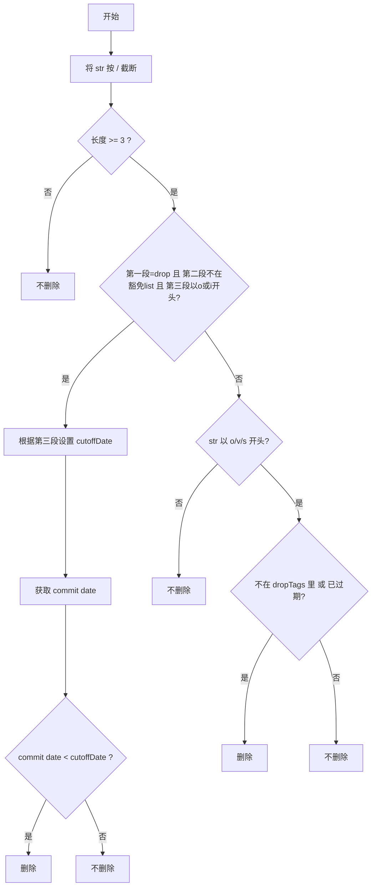

# Tag 删除判断流程

```mermaid
flowchart TD
    A[开始] --> B[将 str 按 / 截断]
    B --> C{长度 >= 3 ?}

    C -- 否 --> N1[不删除]

    C -- 是 --> D{第一段=drop 且 第二段不在豁免list 且 第三段以o或i开头?}
    D -- 是 --> E[根据第三段设置 cutoffDate]
    E --> F[获取 commit date]
    F --> G{commit date < cutoffDate ?}
    G -- 是 --> Y1[删除]
    G -- 否 --> N2[不删除]

    D -- 否 --> H{str 以 o/v/s 开头?}
    H -- 否 --> N3[不删除]
    H -- 是 --> I{不在 dropTags 里 或 已过期?}
    I -- 是 --> Y2[删除]
    I -- 否 --> N4[不删除]
```