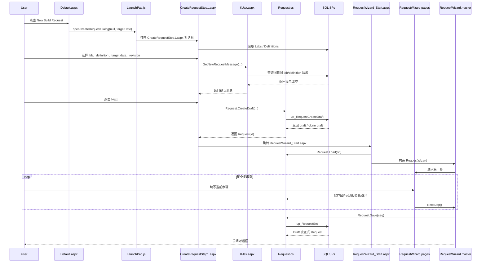

# openCreateRequestDialog 完整流程

本文档整理了 LaunchPad 中从 `openCreateRequestDialog` 开始，到请求草稿创建、进入向导、逐步保存、最终提交为正式 Request 的完整链路。

## 1. 入口

入口在 [src/LaunchPad/Default.aspx](src/LaunchPad/Default.aspx#L141)。

首页任务区的 `New Build Request` 会调用：

```javascript
openCreateRequestDialog(null, targetDate);
```

对应的前端函数定义在 [src/LaunchPad/Scripts/LaunchPad.js](src/LaunchPad/Scripts/LaunchPad.js#L147)：

```javascript
function openCreateRequestDialog(labId, targetDate, isValidationBuild)
{    
    var url = '/LaunchPad/CreateRequestStep1.aspx?';
    
    if(labId != null)
        url += '&LabID=' + labId
        
    if(targetDate != null)
        url += '&TargetDate=' + targetDate

    if (isValidationBuild != null)
        url += '&IsValBuildRequest=' + isValidationBuild
        
    openDialogWithBlocking(url, 650, 500);
}
```

它做了两件事：

1. 拼出 `CreateRequestStep1.aspx` 的 URL。
2. 用 `openDialogWithBlocking` 打开一个模态对话框。

## 2. CreateRequestStep1：选择实验室、Definition、日期、版本号

页面入口：

- [src/LaunchPad/CreateRequestStep1.aspx](src/LaunchPad/CreateRequestStep1.aspx)
- [src/LaunchPad/CreateRequestStep1.aspx.cs](src/LaunchPad/CreateRequestStep1.aspx.cs#L17)

### 2.1 首次加载

`Page_Load` 在首次进入时按这个顺序执行：

1. `LoadLabs()`
2. `LoadSettingsFromQueryString()`
3. `LoadLabDefinitions()`

相关代码在 [src/LaunchPad/CreateRequestStep1.aspx.cs](src/LaunchPad/CreateRequestStep1.aspx.cs#L17)。

### 2.2 LoadLabs

`LoadLabs()` 调用 `Lab.LoadLPEnabled()`，加载被标记为 LP-enabled 的实验室：

- [src/LaunchPad/CreateRequestStep1.aspx.cs](src/LaunchPad/CreateRequestStep1.aspx.cs#L58)

### 2.3 LoadSettingsFromQueryString

这里会读取：

1. `LabID`
2. `Seq`

代码见 [src/LaunchPad/CreateRequestStep1.aspx.cs](src/LaunchPad/CreateRequestStep1.aspx.cs#L50)。

需要注意一个实现细节：

- 前端 URL 里传了 `TargetDate`
- 但当前后端没有消费这个 query string
- `txtTargetDate` 仍然被直接设置为 `DateTime.Today.AddDays(1)`

这意味着如果页面打开后目标日期和前端传入的不一致，优先看这里。

### 2.4 LoadLabDefinitions

`LoadLabDefinitions()` 会根据当前 `ddlLab` 选中的 Lab 加载可用 Definition：

- [src/LaunchPad/CreateRequestStep1.aspx.cs](src/LaunchPad/CreateRequestStep1.aspx.cs#L64)

处理逻辑：

1. 调用 `LabDefinition.LoadByLab(labId)`。
2. 过滤掉 `IsValidationDefinition == false` 之外的项。
3. 按 `Language` 和 `Description` 排序。
4. 绑定到 `rptDefinitions` 和 `rdoDefinitions`。
5. 默认选中第一项并生成 Build Number。
6. 调用 `ValidateSelection()` 做可请求性校验。

### 2.5 前端点 Next 之前的校验

前端 `onNextClick()` 在 [src/LaunchPad/CreateRequestStep1.aspx](src/LaunchPad/CreateRequestStep1.aspx#L76)。

它做两类检查：

1. `revision` 不能为空。
2. 调用 `KJax.GetNewRequestMessage(labId, definitionId, revision, targetDate)` 做重复请求提示。

后端实现位于 [src/LaunchPad/KJax.aspx.cs](src/LaunchPad/KJax.aspx.cs#L38)。

处理逻辑：

1. 读取同一天、同 lab、同 definition 下的请求。
2. 仅保留 `Requested` 或 `PendingApproval`。
3. 如果发现相同 revision：
   - 若现有请求是 Template，则提示当前操作会 override 模板实例。
   - 否则提示用户是否应改为编辑现有请求。

### 2.6 服务端点击 Next：创建或克隆 Draft Request

真正创建 Request 的位置在 [src/LaunchPad/CreateRequestStep1.aspx.cs](src/LaunchPad/CreateRequestStep1.aspx.cs#L40)。

核心代码：

```csharp
LaunchPad.Components.Request newRequest = LaunchPad.Components.Request.CreateDraft(definitionId,labId,targetDate,revision);
string url = string.Format("RequestWizard_Start.aspx?rid={0}&Seq={1}", newRequest.Id, (int)_RequestSequence);
```

`Request.CreateDraft` 定义在 [src/LaunchPad.Components/Request.cs](src/LaunchPad.Components/Request.cs#L613)，最终调用数据库存储过程：

- [src/LaunchPad.Database/Schema Objects/Schemas/dbo/Programmability/Stored Procedures/up_RequestCreateDraft.proc.sql](src/LaunchPad.Database/Schema%20Objects/Schemas/dbo/Programmability/Stored%20Procedures/up_RequestCreateDraft.proc.sql#L1)

这个存储过程的主要逻辑：

1. 先查同 `TargetDate + Lab + Definition` 下状态为 `PendingApproval` 或 `Requested` 的请求。
2. 如果 revision 相同，优先复用已有请求，走 `up_RequestClone`。
3. 如果没有匹配 revision，但有模板请求，也可能从模板克隆。
4. 如果都没有，则插入新记录到 `tbl_Request`。
5. 新插入记录会带：
   - `ReIsDraft = 1`
   - `ReIsTemplate = 0`
   - `ReRevision = @Revision`
6. 初始状态取决于 `LDeRequiresApproval`：
   - 需要审批则是 `PendingApproval`
   - 否则是 `Requested`

创建完成后，页面通过脚本重定向到：

`RequestWizard_Start.aspx?rid=<RequestId>&Seq=<Sequence>`

## 3. RequestWizard_Start：进入动态向导

入口文件：

- [src/LaunchPad/RequestWizard_Start.aspx.cs](src/LaunchPad/RequestWizard_Start.aspx.cs#L15)

这个页面本身不展示 UI，只负责根据 `rid` 和 `seq` 跳到正确的第一步。

逻辑：

1. 从 query string 读取 `rid` 和 `seq`。
2. 创建 `RequestWizard` 实例。
3. 根据当前请求状态决定跳到哪里：
   - 如果状态是 `ReadyToSchedule`、`Launched`、`Failed`，跳到 launch-time 分支第一步。
   - 否则跳到 `Steps[0]`。

## 4. RequestWizard：向导步骤是动态拼出来的

核心类在 [src/LaunchPad/RequestWizard.cs](src/LaunchPad/RequestWizard.cs#L15)。

### 4.1 加载方式

构造函数会先 `Request.Load(requestId)`，再按 Definition 和 Sequence 计算整条向导路径。

### 4.2 Step 分组

在 `LoadSteps()` 中，步骤分两组：

1. `requestSteps`
   - `RequiredInRequest || RequiredInTemplate`
2. `launchTimeSteps`
   - 其余步骤，也就是 `IsLaunchStep == true`

`IsLaunchStep` 的判定在 [src/LaunchPad.Components/DefinitionStep.cs](src/LaunchPad.Components/DefinitionStep.cs#L56)。

### 4.3 末尾步骤

末尾步骤的追加规则：

1. 如果当前 Definition 是 ValidationDefinition 且 Sequence 是 Request：
   - 最后追加 `Summary`
2. 否则：
   - 最后追加 `Comments`

实现位置：

- [src/LaunchPad/RequestWizard.cs](src/LaunchPad/RequestWizard.cs#L165)
- [src/LaunchPad/RequestWizard.cs](src/LaunchPad/RequestWizard.cs#L176)

### 4.4 StepType 到页面的映射

映射在 [src/LaunchPad/RequestWizard.cs](src/LaunchPad/RequestWizard.cs#L279)。

| StepType | 页面 |
| --- | --- |
| LaunchTime | RequestWizard_LaunchTime.aspx |
| Properties | RequestWizard_Properties.aspx |
| BuildProperties | RequestWizard_BuildProperties.aspx |
| Builds | RequestWizard_Builds.aspx |
| BuildResources | RequestWizard_BuildResources.aspx |
| Resources | RequestWizard_Resources.aspx |
| Comments | RequestWizard_Comments.aspx |
| Summary | RequestWizard_Summary.aspx |
| SyncTime | RequestWizard_SyncTime.aspx |
| BuddyTest | RequestWizard_BuddyTest.aspx |
| BVTSpecs | RequestWizard_BVTSpecs.aspx |

说明：

- 当前仓库中没有找到 `RequestWizard_BuddyTest.aspx.cs` 和 `RequestWizard_BVTSpecs.aspx.cs`，说明框架支持这两类 step，但当前工作区不一定包含对应页面实现。

## 5. 各向导页面保存什么

### 5.1 Properties

文件：

- [src/LaunchPad/RequestWizard_Properties.aspx.cs](src/LaunchPad/RequestWizard_Properties.aspx.cs#L136)

处理逻辑：

1. 逐个读表单值。
2. 调用 Property 的 `VerifyValue()` 做校验。
3. 校验通过后：
   - 有现成 RequestProperty 则改值
   - 没有则 `m_Request.Properties.Add(property.Id, propVal)`

### 5.2 Builds

文件：

- [src/LaunchPad/RequestWizard_Builds.aspx.cs](src/LaunchPad/RequestWizard_Builds.aspx.cs#L81)

处理逻辑：

1. 遍历当前 Definition 中所有可选 Build。
2. 根据 checkbox 是否勾选决定是否加入 `m_Request.Builds`。
3. 如果一个都没选，则报错。

### 5.3 Resources

文件：

- [src/LaunchPad/RequestWizard_Resources.aspx.cs](src/LaunchPad/RequestWizard_Resources.aspx.cs#L220)

处理逻辑：

1. 从页面提交的 `lstAvailableResources` 里取用户选的资源。
2. 组装 `ResourceUsage`。
3. 用 `requirement.VerifyUsage()` 做校验。
4. 校验通过后逐个 `ru.Save()`。
5. 如果是 DropServer，还会额外写变更日志并清空 `Drop Server Drive`。

### 5.4 BuildResources

文件：

- [src/LaunchPad/RequestWizard_BuildResources.aspx.cs](src/LaunchPad/RequestWizard_BuildResources.aspx.cs#L343)

处理逻辑：

1. 对每个已选 Build，读取 build machine dropdown 和属性 dropdown。
2. 组装带 `ResourceUsageAttribute` 的 `ResourceUsage`。
3. 调 `requirement.VerifyUsage()` 校验。
4. 校验通过后 `usage.Save()`。
5. 然后调用 `Resource.UpdateBuildMachineState()`，避免下一次分配时重复使用。

### 5.5 SyncTime

文件：

- [src/LaunchPad/RequestWizard_SyncTime.aspx.cs](src/LaunchPad/RequestWizard_SyncTime.aspx.cs#L280)

这个页面保存的内容比较多，包括：

1. `Shelveset`
2. `Revision`
3. `Build Label`
4. `Use Build Label`
5. `Run BVTs`
6. `Run RPS`
7. `RPS Baseline Branch`
8. `RPS Baseline Build Number`
9. `Disable Auto Issue Creation`
10. `RET SKU List`
11. `CHK SKU List`

额外逻辑：

1. 它会根据 RET / CHK 复选框重建 `m_Request.Builds`。
2. 当 BVT 相关条件发生变化时，会清空 `BVT Specs`。

### 5.6 LaunchTime

文件：

- [src/LaunchPad/RequestWizard_LaunchTime.aspx.cs](src/LaunchPad/RequestWizard_LaunchTime.aspx.cs#L60)

处理逻辑：

1. 把用户选择的日期和时间拼成一个 `DateTime`。
2. 写回 `m_Request.LaunchTime`。
3. 同时把 `txtBuildNumber.Text` 写回 `m_Request.Revision`。

### 5.7 Comments

文件：

- [src/LaunchPad/RequestWizard_Comments.aspx.cs](src/LaunchPad/RequestWizard_Comments.aspx.cs#L20)

处理逻辑：

1. 如果备注不为空，则 `m_Request.Comments.Add(...)`。
2. 如果当前是 Launch 序列，还会保存 `IsTestBuild`。

### 5.8 Summary

文件：

- [src/LaunchPad/RequestWizard_Summary.aspx.cs](src/LaunchPad/RequestWizard_Summary.aspx.cs#L109)

处理逻辑：

1. 展示汇总信息。
2. 对 RequestProperty 再做一轮最终验证。
3. 验证通过后进入 `m_MasterPage.NextStep()`。

Summary 本身不负责最终提交；真正提交在 Master 的 `Finish()`。

## 6. RequestWizardMaster：前进、后退、Finish

核心文件：

- [src/LaunchPad/RequestWizard.master.cs](src/LaunchPad/RequestWizard.master.cs#L1)

### 6.1 NextStep

`NextStep()` 位于 [src/LaunchPad/RequestWizard.master.cs](src/LaunchPad/RequestWizard.master.cs#L195)。

规则：

1. 如果当前是 `Comments` 或 `Summary`，直接进入 `Finish()`。
2. 如果当前是 `LaunchTime`，跳到 launch 分支下一步。
3. 否则调用当前 DefinitionStep 的 `GetNext()`。
4. 如果没有 next，则跳最后一步。
5. 如果从 request step 跨到 launch step，中间会先跳到 launch-time 的第一页。

### 6.2 PreviousStep

`PreviousStep()` 位于 [src/LaunchPad/RequestWizard.master.cs](src/LaunchPad/RequestWizard.master.cs#L242)。

它会根据当前 step 类型、是否是 conditional sub-step、是否处于 launch 分支，动态回到上一页。

DefinitionStep 的导航本身来自：

- [src/LaunchPad.Components/DefinitionStep.cs](src/LaunchPad.Components/DefinitionStep.cs#L82)

也就是数据库层的 `GetNextDefinitionStep()` / `GetPreviousDefinitionStep()`。

### 6.3 Finish

真正的完成逻辑在 [src/LaunchPad/RequestWizard.master.cs](src/LaunchPad/RequestWizard.master.cs#L313)：

```csharp
m_RequestWizard = new RequestWizard(m_RequestId, m_Sequence);
m_RequestWizard.Request.Save(m_Sequence);
Common.SendDialogCloseCommand(Page.ClientScript, message);
```

含义：

1. 重新加载 Request，确保拿到最新保存状态。
2. 执行 `Request.Save(sequence)`。
3. 关闭弹窗。

## 7. Request.Save：Draft 变成正式 Request

### 7.1 代码入口

`Request.Save()` 在 [src/LaunchPad.Components/Request.cs](src/LaunchPad.Components/Request.cs#L407)。

它调用：

- [src/LaunchPad.Components/LaunchPadDB.cs](src/LaunchPad.Components/LaunchPadDB.cs#L884)

然后落到存储过程：

- [src/LaunchPad.Database/Schema Objects/Schemas/dbo/Programmability/Stored Procedures/up_RequestSet.proc.sql](src/LaunchPad.Database/Schema%20Objects/Schemas/dbo/Programmability/Stored%20Procedures/up_RequestSet.proc.sql#L1)

### 7.2 Request 序列下的行为

当 `@Sequence = 2`，也就是 Request：

1. 存储过程会再查一次同 `TargetDate + Lab + Definition (+ Revision)` 下已有的非模板请求。
2. 如果找到已存在请求，则执行 `up_RequestMerge`。
3. 如果没有找到：
   - `ReIsDraft = 0`
   - `TemplateRequestID` 清理或保留，取决于序列
   - `RequestStatusID = 5`，也就是 `Requested`

也就是说，向导最终收口后，草稿会被正式提交为一个 `Requested` 状态的 Request。

## 8. 提交后的下一站

`openCreateRequestDialog` 这条链路到 `Finish()` 就结束了。

提交后的 Request 并不会立刻由当前页面继续处理，而是进入后续状态流转。

服务端轮询入口在：

- [src/LaunchPad.Service/Components/RequestProcessor.cs](src/LaunchPad.Service/Components/RequestProcessor.cs#L20)
- [src/LaunchPad.Service/LaunchPad.Service.cs](src/LaunchPad.Service/LaunchPad.Service.cs#L39)

LaunchPad Service 会按 `ProcessIntervalMinutes` 周期轮询 `ReadyToLaunch` 的请求，而不是 `Requested`。因此：

1. `openCreateRequestDialog` 这条链的结束状态通常是 `Requested`
2. 后续还需要经过系统其他逻辑把请求推进到 `ReadyToLaunch`
3. 到那时才会由后台 Service 真正接手 Launch

## 9. 一张时序图



## 10. 结论

从 `openCreateRequestDialog` 开始的主链是：

1. 首页打开创建请求弹窗
2. 选择 Lab / Definition / 日期 / Revision
3. 创建或克隆一个 Draft Request
4. 进入动态拼装的 RequestWizard
5. 在每个步骤页即时保存当前块数据
6. 在 Comments 或 Summary 收口
7. `Finish()` 调 `Request.Save(RequestSequence.Request)`
8. Draft 被提交成正式 Request，状态通常为 `Requested`

## 11. 当前已确认的可疑点和注意事项

1. `TargetDate` 虽然被前端传进了 URL，但 `CreateRequestStep1.aspx.cs` 当前没有读取它。
2. `BuddyTest` / `BVTSpecs` 这两个 step type 在映射中存在，但当前工作区没有找到对应页面实现。
3. `Requested` 并不是最终 launch 状态；后台 Service 真正消费的是 `ReadyToLaunch`。

## 12. Requested 之后的后半段总览

`openCreateRequestDialog` 那条链路结束后，请求通常会处于 `Requested` 状态。

从这里开始，后半段可以分成两条主路径：

1. 自动调度路径：由定时任务调用 `AutoLaunchServices`，自动补齐资源并推进到 `ReadyToLaunch`
2. 人工 Launch 路径：管理员在 UI 中点击 `Launch...`，先走预检查，再进入 Launch 序列向导，最后推进到 `ReadyToLaunch`

后台 Windows Service 真正接手的条件只有一个：

- Request 已经进入 `ReadyToLaunch`

对应状态定义见 [src/LaunchPad.Components/Enumerations.cs](src/LaunchPad.Components/Enumerations.cs#L44)。

```csharp
Requested = 5,
ReadyToSchedule = 6,
ReadyToLaunch = 7,
Launching = 8,
Launched = 9,
Failed = 10
```

## 13. Requested -> ReadyToLaunch：自动调度路径

### 13.1 哪些 Requested 会被自动处理

自动调度入口在：

- [src/LaunchPad/Services/AutoLaunchServices.asmx.cs](src/LaunchPad/Services/AutoLaunchServices.asmx.cs#L1)

核心方法：

1. `MaterializeAutoLaunchRequestTemplates()`
2. `PrepareAutoLaunchRequestsForLaunching()`

### 13.2 模板先被物化成实际 Request

`MaterializeAutoLaunchRequestTemplates()` 会找出：

1. 目标日期为明天的 Request
2. 其中是 Template 的请求
3. 满足 `IsReadyToMaterializeForAutoLaunch`

然后调用：

- [src/LaunchPad/Common.cs](src/LaunchPad/Common.cs#L624)

```csharp
LaunchPad.Components.Request request = LaunchPad.Components.Request.Clone(requestId, targetDate, revision);
request.Save(RequestSequence.Prepare);
```

这里的含义是：

1. 从模板克隆出具体 Request
2. 用 `RequestSequence.Prepare` 保存

注意：当前代码里 `Prepare` 并不会把请求写成 `ReadyToSchedule`，它最终仍会走到 `Requested`，因为 `up_RequestSet` 对 `Sequence = 4` 并没有写状态 6。

### 13.3 自动筛选可 launch 的 Request

真正进入自动 Launch 准备的是：

- [src/LaunchPad.Components/Request.cs](src/LaunchPad.Components/Request.cs#L789)

```csharp
public static RequestCollection LoadByReadyToBeProcessedForLaunch(DateTime targetDate)
```

它的筛选条件是：

1. `Status == Requested`
2. `!IsTemplate`
3. 已经过了 AutoLaunch 的时间点
4. `AutoLaunch == true`
5. 不是 ValidationDefinition

其中关键布尔判断见 [src/LaunchPad.Components/Request.cs](src/LaunchPad.Components/Request.cs#L233)：

```csharp
return Status == RequestStatus.Requested && (!IsTemplate) && IsPastAutoLaunchTime && AutoLaunch;
```

### 13.4 AutoLaunchServices 做的事

`PrepareAutoLaunchRequestsForLaunching()` 会：

1. 读取目标日期的候选请求
2. 运行 Build Machine Selection 算法
3. 对每个候选请求执行 `PrepareSingleRequestForAutoLaunching()`

实现位于 [src/LaunchPad/Services/AutoLaunchServices.asmx.cs](src/LaunchPad/Services/AutoLaunchServices.asmx.cs#L38)。

`PrepareSingleRequestForAutoLaunching()` 的主要步骤：

1. 尝试自动分配最佳 SAN
2. 选择 Drop Server
3. 为当前 Request 的所有 Build 找 Build Machine
4. 调用 `AssignDropAndBuildResourcesToRequest()` 把资源 usage 写入数据库
5. 最后执行：

```csharp
req.Save(RequestSequence.Launch);
```

这段在 [src/LaunchPad/Services/AutoLaunchServices.asmx.cs](src/LaunchPad/Services/AutoLaunchServices.asmx.cs#L136)。

### 13.5 为什么 Save(RequestSequence.Launch) 会变成 ReadyToLaunch

`Request.Save()` 最终还是走 `up_RequestSet`：

- [src/LaunchPad.Database/Schema Objects/Schemas/dbo/Programmability/Stored Procedures/up_RequestSet.proc.sql](src/LaunchPad.Database/Schema%20Objects/Schemas/dbo/Programmability/Stored%20Procedures/up_RequestSet.proc.sql#L1)

当 `@Sequence = 3` 也就是 Launch 时：

1. 写入日志 `Request set to Ready to Launch`
2. `ReIsDraft = 0`
3. `RequestStatusID = 7`

也就是 `ReadyToLaunch`。

## 14. Requested -> ReadyToLaunch：人工 Launch 路径

### 14.1 管理员从哪里点 Launch

首页调用链在：

- [src/LaunchPad/Default.aspx](src/LaunchPad/Default.aspx#L72)

```javascript
function launchRequest(requestId,revision)
{
   openBuildWizardDialogForLaunch(requestId, targetDate, revision);
}
```

这个函数会打开：

- [src/LaunchPad/Scripts/LaunchPad.js](src/LaunchPad/Scripts/LaunchPad.js#L206)

也就是：

`/LaunchPad/LaunchRequestStep1.aspx?RequestID=...&TargetDate=...&Revision=...`

### 14.2 LaunchRequestStep1 不是正式向导，而是预检查页

页面位于：

- [src/LaunchPad/LaunchRequestStep1.aspx](src/LaunchPad/LaunchRequestStep1.aspx#L1)
- [src/LaunchPad/LaunchRequestStep1.aspx.cs](src/LaunchPad/LaunchRequestStep1.aspx.cs#L1)

这个页面会在加载后自动串行执行几项检查：

1. `PrepareRequestForLaunchAsync`
2. `ValidateRequestPropertiesAsync`
3. `CheckMachinePoolsAsync`
4. `AJAXCalls.CheckDropSpace`

这些前端步骤可见于 [src/LaunchPad/LaunchRequestStep1.aspx](src/LaunchPad/LaunchRequestStep1.aspx#L56)。

### 14.3 预检查背后的后端含义

#### PrepareRequestForLaunch

对应方法在 [src/LaunchPad/KJax.aspx.cs](src/LaunchPad/KJax.aspx.cs#L122)。

逻辑：

1. 如果当前 request 是 template，就先 `MaterializeTemplateIntoRequest`
2. 如果不是 template，就直接返回原 requestId

也就是说，这一步主要是在 launch 前确保手里拿到的是一个可 launch 的具体 Request，而不是模板。

#### ValidateRequestProperties

对应方法在 [src/LaunchPad/KJax.aspx.cs](src/LaunchPad/KJax.aspx.cs#L190)。

它会校验当前 Definition 中所有 `RequiredInRequest` 的属性，以及隐藏属性，确保 launch 前关键信息已齐全。

#### CheckMachinePools

对应方法在 [src/LaunchPad/KJax.aspx.cs](src/LaunchPad/KJax.aspx.cs#L141)。

它会检查：

1. 如果 workflow 需要 BuildMachine，则当前 lab 必须有关联 BuildPool
2. 如果 workflow 需要 DropServer，则当前 lab 必须有关联 DropPool

#### CheckDropSpace

入口在 [src/LaunchPad/Services/AJAXCalls.cs](src/LaunchPad/Services/AJAXCalls.cs#L109)，内部调用：

- [src/LaunchPad/Common.cs](src/LaunchPad/Common.cs#L636)

它负责检查 drop 空间是否足够，以及是否要先标记某个旧 drop 为待删除。

### 14.4 预检查通过后发生什么

当预检查通过，用户点击 Next，会进入：

`RequestWizard_Start.aspx?rid=...&seq=Launch`

然后走的是 Launch 序列的 RequestWizard，而不是 Request 序列。

Launch 序列和 Request 序列的区别：

1. 会包含 `LaunchTime` 这类 launch step
2. 最终调用的是 `Request.Save(RequestSequence.Launch)`
3. 因而最终状态会被推进到 `ReadyToLaunch`

## 15. ReadyToSchedule 在当前代码里的位置

`ReadyToSchedule` 这个状态在当前工作区里仍然存在，但我没有追到明确的“现行写入路径”。

已确认的信息：

1. 它在枚举里定义为 6，见 [src/LaunchPad.Components/Enumerations.cs](src/LaunchPad.Components/Enumerations.cs#L49)
2. UI 会把它当作类似 `Requested` 的展示状态，见 [src/LaunchPad/Controls/BuildRequest.ascx.cs](src/LaunchPad/Controls/BuildRequest.ascx.cs#L59)
3. `RequestWizard_Start.aspx` 会把它视为可以直接走 launch 分支的状态，见 [src/LaunchPad/RequestWizard_Start.aspx.cs](src/LaunchPad/RequestWizard_Start.aspx.cs#L29)

但在当前仓库中：

1. 没有直接找到把 `RequestStatusID` 写成 6 的业务代码
2. 也没有在数据库脚本中直接搜到 `RequestStatusID = 6` 的设置语句

因此当前更稳妥的结论是：

- `ReadyToSchedule` 很可能是遗留或过渡状态
- 在当前主干逻辑里，真正重要的推进点仍然是 `Requested -> ReadyToLaunch`

## 16. ReadyToLaunch -> Service 接手

### 16.1 Service 如何发现待处理请求

Windows Service 的入口类在：

- [src/LaunchPad.Service/LaunchPad.Service.cs](src/LaunchPad.Service/LaunchPad.Service.cs#L1)

它会按 `ProcessIntervalMinutes` 周期轮询：

- [src/LaunchPad.Service/Components/RequestProcessor.cs](src/LaunchPad.Service/Components/RequestProcessor.cs#L20)

核心调用是：

```csharp
RequestCollection requests = Request.LoadReadyToLaunch(CollectionHandler.GetAppSettingsHandler()["ServiceInstanceName"]);
```

而 `LoadReadyToLaunch()` 位于：

- [src/LaunchPad.Components/Request.cs](src/LaunchPad.Components/Request.cs#L836)

最终走数据库 `GetRequestsToLaunch()`。

### 16.2 Service 一接手会先把请求标成 Launching

在 [src/LaunchPad.Service/Components/RequestProcessor.cs](src/LaunchPad.Service/Components/RequestProcessor.cs#L28) 中：

1. 拿到 `ReadyToLaunch` 请求集合
2. 对每个请求先执行：

```csharp
request.Status = RequestStatus.Launching;
```

3. 然后把具体处理放进线程池执行

也就是说，`ReadyToLaunch` 是“等待服务接手”，`Launching` 是“服务已经开始处理”。

### 16.3 SingleRequestProcessor 做的事

真正执行 launch 的逻辑在：

- [src/LaunchPad.Service/Components/RequestProcessor.cs](src/LaunchPad.Service/Components/RequestProcessor.cs#L127)

主要步骤：

1. 检查 RPC 连通性
2. 为每个 Build 预先创建 SessionId / BuildId
3. 执行所有 PreLaunchAssembly
4. 遍历每个 Build，把 build 状态先改成 `Launching`
5. 对每个资源执行 LaunchScript
6. 成功后把 build 状态改成 `Launched`
7. 如果所有 Build 都成功，则把 request 状态改成 `Launched`

关键状态更新见：

1. `build.Status = RequestStatus.Launching`
2. `build.Status = RequestStatus.Launched`
3. `m_Request.Status = RequestStatus.Launched`

都在 [src/LaunchPad.Service/Components/RequestProcessor.cs](src/LaunchPad.Service/Components/RequestProcessor.cs#L208)。

### 16.4 失败时怎么处理

如果 launch 过程中发生 `RequestLaunchException` 或其他异常：

1. request 状态会被改成 `Failed`
2. 同时写入 launch log

对应逻辑在 [src/LaunchPad.Service/Components/RequestProcessor.cs](src/LaunchPad.Service/Components/RequestProcessor.cs#L265)。

所以 Service 接手后的完整状态链通常是：

1. `ReadyToLaunch`
2. `Launching`
3. `Launched` 或 `Failed`

## 17. “your build has been scheduled” 对应到代码里更接近什么

当前工作区里我没有直接搜到精确字面量 `your build has been scheduled`。

从代码行为看，这句话更接近下面两种语义之一：

1. 用户完成请求创建后，看到请求已经处于 `Requested` / `ReadyToSchedule` 这类“已排入队列”的状态
2. AutoLaunch 或人工 Launch 完成准备后，请求进入 `ReadyToLaunch`，等待 Windows Service 真正接手

在 UI 展示上：

1. `Requested` 和 `ReadyToSchedule` 共用同一类视觉状态，见 [src/LaunchPad/Controls/BuildRequest.ascx.cs](src/LaunchPad/Controls/BuildRequest.ascx.cs#L59)
2. `ReadyToLaunch` 会显示为更明确的 launch-ready 样式，见 [src/LaunchPad/Controls/BuildRequest.ascx.cs](src/LaunchPad/Controls/BuildRequest.ascx.cs#L65)

如果后续需要精确定位这句话的来源，比较可能的方向是：

1. 数据库或外部服务生成的提示文案
2. 历史前端资源、邮件模板或未纳入当前工作区的页面

## 18. 后半段一句话总结

`Requested` 之后，系统不会立刻开始 launch；它会先通过自动任务或人工 Launch 流程补齐资源和预检查，把请求推进到 `ReadyToLaunch`，然后再由 LaunchPad Windows Service 轮询接手，改成 `Launching`，最终落到 `Launched` 或 `Failed`。
